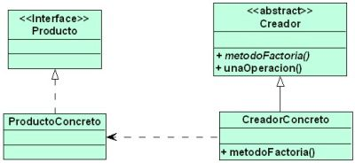
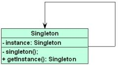
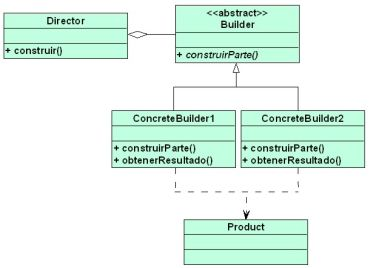
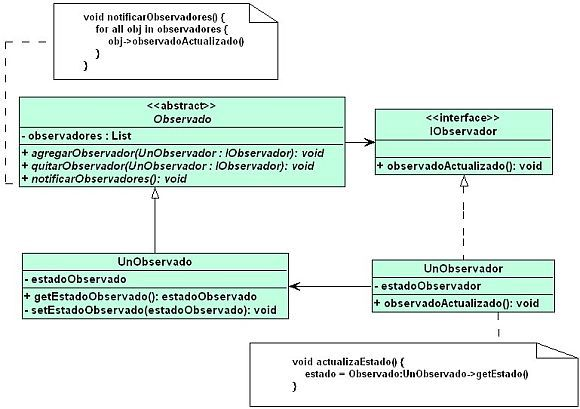
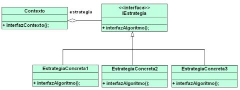
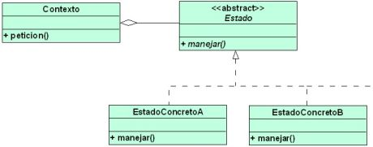
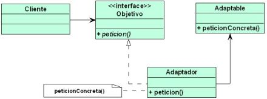

##Patrones de diseño mas conocidos:

## Patrones creacionales
1. Factory method
    Este patrón ofrece una interfaz para crear nuevos objetos dentro de una superclase permitiendo que las subclases cambien el tipo de objetos que van a crear.

2. Singleton
    Se utiliza para restringir la creación de nuevas instancias de una clase a un objeto determinado.

3. Builder
    El patrón constructor se utiliza para crear diferentes objetos a partir de una serie de pasos reutilizando el código de construcción. Esto simplifica la necesidad de crear subclases para cada configuración posible de un objeto particular.

## Patrones de comportamiento
4. Observer
    A través de este patrón de comportamiento varios objetos interesados (suscriptores) en un objeto en particular (notificador) pueden recibir notificaciones de su comportamiento mientras estén suscriptos a sus notificaciones.

5. Strategy
    Permite separar todos los algoritmos de una clase específica en nuevas clases separadas donde los objetos pueden intercambiarse.

6. State
    Se utiliza para modificar el comportamiento de una clase de objetos dependiendo del estado actual (comportamiento interno) de dichos objetos.

## Patrones estructurales
7. Adapter
    Es un patrón que se utiliza para que objetos con interfaces incompatibles colaboren entre sí.

